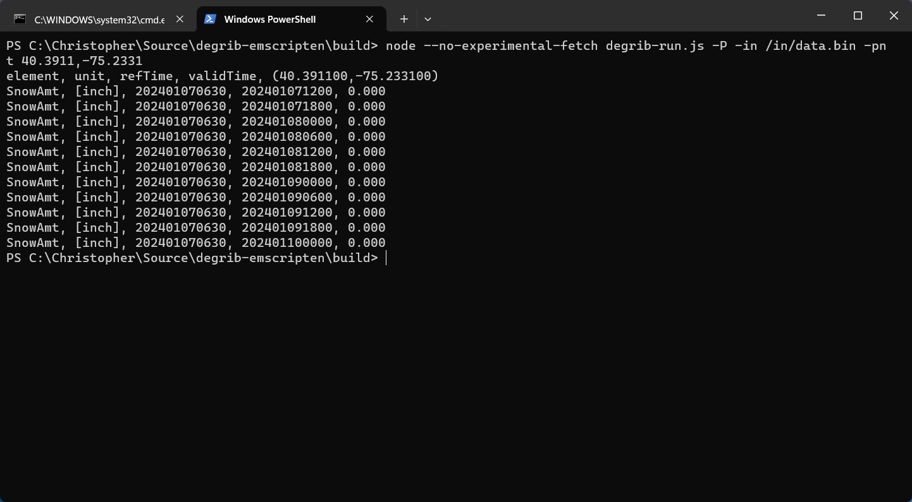

# Emscripten Project - NWS DeGRIB

## National Weather Service DeGRIB for Emscripten (Javascript/WASM)

The National Weather Service's DEGRIB application is a powerful tool designed for meteorologists and weather enthusiasts. It enables users to decode GRIB (Gridded Binary) files, a standard format used for transmitting weather data such as forecasts and observational data. The DEGRIB application translates these complex files into a more accessible format, allowing users to view and analyze meteorological data in a user-friendly way. It supports a wide range of data types, including temperature, wind, precipitation, and atmospheric pressure, making it an invaluable resource for understanding and predicting weather patterns. The application is known for its accuracy, reliability, and comprehensive coverage of weather data, making it an essential tool for professionals in meteorology and related fields.

## Emscripten

Emscripten is an open-source compiler that plays a critical role in web development and software engineering. It translates C and C++ code into JavaScript, allowing programs written in these languages to run in a web browser. This is particularly significant for bringing high-performance applications, like games or complex computational algorithms, to the web. Emscripten achieves this by converting C/C++ code into ASM.js, a subset of JavaScript that can be executed efficiently by modern web browsers. Additionally, it supports WebAssembly, a binary instruction format that provides an even faster execution of code on web platforms. By bridging the gap between powerful, traditionally desktop-bound languages and the web, Emscripten opens up new possibilities for web-based applications, enhancing their performance and expanding their capabilities. Its impact is notable in the realms of web gaming, simulations, and any application that requires intensive computational work, making it a pivotal tool in contemporary web technology.

## Modifications

There is **modifications** inside the codebase in order to compile with Emscripten and web assembly. Please notate I have done my best to keep these changes clean inside the source code. 

## Issues

Please report all issues using GitHub. I will not accept support requests, bug fixes, and/or feature requests by other communication methods or personal e-mail. 

## Donate

If you are interested in keeping this open source project running please consider donating or sponsoring this project:

* [https://chriszenzel.com/donate/](https://chriszenzel.com/donate/)

## Project Authors and Credits

* Christopher Zenzel
* Credit to the National Weather Service for the DeGRIB Application